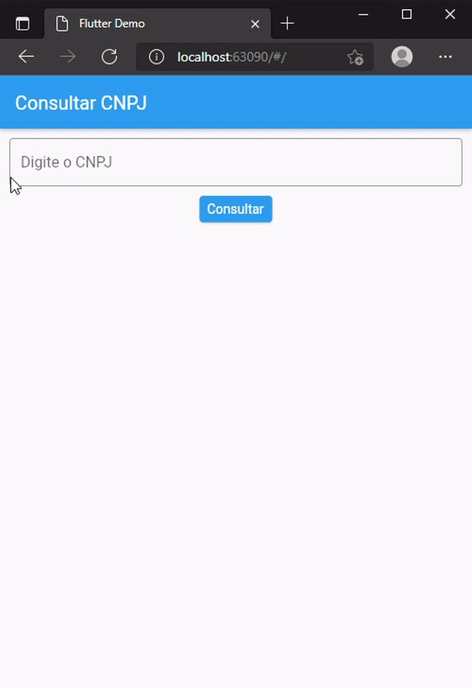

# Consultar CNPJ com padrão BloC

## Projeto possui duas branches onde é aplicado o padrão BloC

Na branch **_bloc_** é aplicado o padrão puro
e na outra branch **_flutter_bloc_** faço uso do packege [flutter_bloc](https://pub.dev/packages/flutter_bloc) para facilitar a implementação do padrão BloC

> Branches

- [bloc](https://github.com/Reketz/ConsultCNPJBloc/tree/bloc)
- [flutter bloc](https://github.com/Reketz/ConsultCNPJBloc/tree/flutter_bloc)

